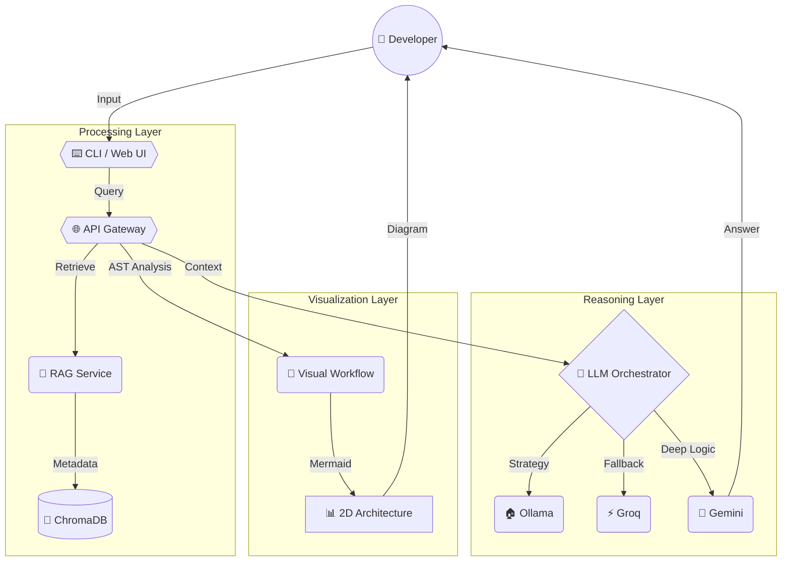

# 🧠 Intelligent Codebase Assistant — v1.0

AI-powered code understanding, debugging, and high-level architectural visualization. Built with a **Hybrid LLM Orchestrator** and a **Semantic RAG Pipeline** to give you deep insights into any codebase within seconds.

---

## 🔥 Key Innovations

### 1. 🎨 Visual Architecture (Adaptive Workflow)
Unlike traditional tools that only show file lists, our assistant generates a **2D Semantic Workflow**. It identifies your entry points, core logic providers, and storage layers, then visualizes them with professional icons and distinct shapes (Hexagons, Diamonds, Cylinders) using Mermaid.

### 2. 🧠 Smart Context Injection (Strict RAG)
We enforce a **Context-Only** response policy. The assistant retrieves relevant AST chunks from a persistent **ChromaDB** store and uses them to anchor every answer. No hallucinated code.

### 3. ⛓️ Hybrid LLM Orchestrator
A robust fallback chain with exponential backoff and 3x retries:
`Local (Ollama) → Cloud (Groq) → Deep Reasoning (Gemini)`

### 4. 🗄️ External Persistence
ChromaDB data is stored **outside the repository** (`../chromadb`) by default, ensuring your project directory stays clean and your vector database persists across multiple project versions.

---

## 📊 Comparison: Standard RAG vs. Our Assistant

| Feature | Standard RAG | **Our Intelligent Assistant** |
| :--- | :--- | :--- |
| **Indexing** | Basic text chunking | **AST-Aware Chunking** (Functions/Classes) |
| **Logic Recovery** | None | **Semantic Architecture Workflows** |
| **Model Choice** | Single Model | **Hybrid Fallback Orchestrator** |
| **Reliability** | Fails on API errors | **3x Retry Logic + Provider Failover** |
| **Visuals** | Static file trees | **Dynamic 2D Mermaid Flowcharts** |
| **Storage** | Local/Temporary | **Persistent External Database** |

---

## 🚀 Comparison with Top AI Editors

Our assistant is designed to **complement**, not compete with, world-class AI editors like Cursor or VS Code Copilot. It provides a specialized "Architect's View" of your codebase that functions alongside your favorite development environment.

| Feature | VS Code Copilot | Cursor IDE | Antigravity | **Our Assistant** |
| :--- | :---: | :---: | :---: | :---: |
| **Inline Autocomplete** | ⭐⭐⭐⭐⭐ | ⭐⭐⭐⭐⭐ | ⭐⭐⭐ | ⭐ |
| **Full Repo Context** | ⭐⭐⭐ | ⭐⭐⭐⭐⭐ | ⭐⭐⭐⭐⭐ | ⭐⭐⭐⭐ |
| **Visual Architecture** | ⭐ | ⭐⭐ | ⭐⭐⭐ | ⭐⭐⭐⭐⭐ |
| **Semantic Analysis** | ⭐⭐ | ⭐⭐⭐⭐ | ⭐⭐⭐⭐⭐ | ⭐⭐⭐⭐⭐ |
| **Codebase Workflows** | ⭐ | ⭐ | ⭐⭐ | ⭐⭐⭐⭐⭐ |
| **Agentic Edits** | ⭐⭐ | ⭐⭐⭐⭐ | ⭐⭐⭐⭐⭐ | ⭐⭐⭐ |
| **Latency / Speed** | ⭐⭐⭐⭐⭐ | ⭐⭐⭐⭐ | ⭐⭐⭐ | ⭐⭐⭐⭐ |
| **Custom Control** | ⭐ | ⭐⭐ | ⭐⭐⭐ | ⭐⭐⭐⭐⭐ |

> [!TIP]
> **Conclusion**: Use Cursor for your daily coding (Best IDE), and use our assistant as the **"Architect's Brain"** for high-level logic visualization, complex architectural planning, and deep semantic debugging. They are the perfect duo!

---

## 🔒 Privacy & Security

We take a **Local-First** approach to your sensitive source code.

-   **Zero Cloud by Default**: If you use **Local (Ollama)**, your code never leaves your machine. All indexing, retrieval, and inference happen on your hardware. **No "Phone Home" or snippet leaks.**
-   **Local Storage**: Your vectorized codebase is stored in **ChromaDB** on your own disk (`../chromadb`). We do not host or upload your indexes.
-   **Opt-In Cloud Inference**: Cloud providers (Groq/Gemini) are only used if you **explicitly** configure API keys in `.env` and select them in the menu.
-   **No Data Training or Telemetry**: Unlike many cloud-first AI editors, **we collect ZERO telemetry.** Your project logic and activity remain entirely private and localized. **No background analytics, no snippet leaks.**

---

## 🏗️ System Workflow



---

## 🚀 Setup & Installation (Windows)

### 1. Prerequisites
- **Python 3.10+**
- **Ollama** (for local models like `llama3:8b`)
- **Groq/Gemini API Keys** (Optional, for cloud fallback)

### 2. Initial Setup
```powershell
git clone <repo-url>
cd Codebase-Assistant

# Create & activate virtual environment
python -m venv .venv
.venv\Scripts\activate

# Install requirements
pip install -r requirements.txt

# Configure environment
copy .env.example .env
```
*Edit `.env` to add your Groq/Gemini keys for the best experience.*

### 3. Launching the Assistant
```powershell
# Start the unified server (API + Web UI)
python main.py
```

---

## 💻 Working with the CLI (`cb`)

The `cb` shortcut provides a "premium" terminal experience with a high-fidelity ASCII banner and specialized menu styles.

| Command | Description |
| :--- | :--- |
| `cb cli` | **Full Interactive Mode** (Chat, Debug, Architecture) |
| `cb index <dir>` | Index a project folder into ChromaDB (Required) |
| `cb web` | Instantly open the Web UI in your browser |
| `cb stop` | Safely shutdown the background server |
| `cb health` | Check reachability of Ollama, Groq, and Gemini |

---

## 📂 Project Structure

-   `cli/` : Interactive terminal interface with `rich` and `questionary`.
-   `services/`
    - `api_gateway/` : FastAPI entry point and endpoint routing.
    - `rag_service/` : ChromaDB management and AST chunking.
    - `graph_service/` : Visual architecture and logic flow generator.
    - `debug_service/` : Log analysis and fix advisor.
-   `shared/`
    - `llm/` : Clients and the Orchestrator brain.
    - `config.py` : Pydantic-based settings management.

---

## 📄 License

MIT — Build something great.
